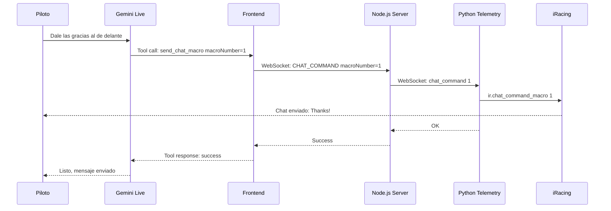
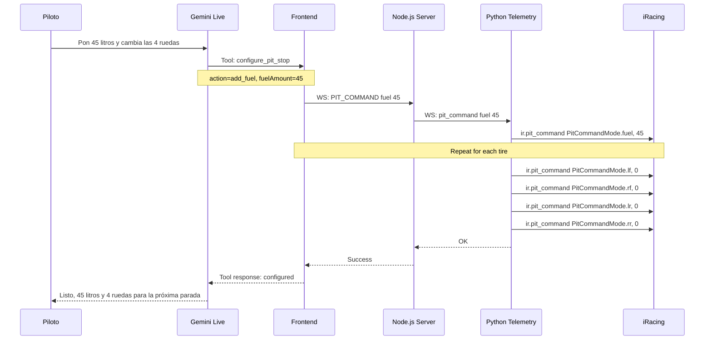
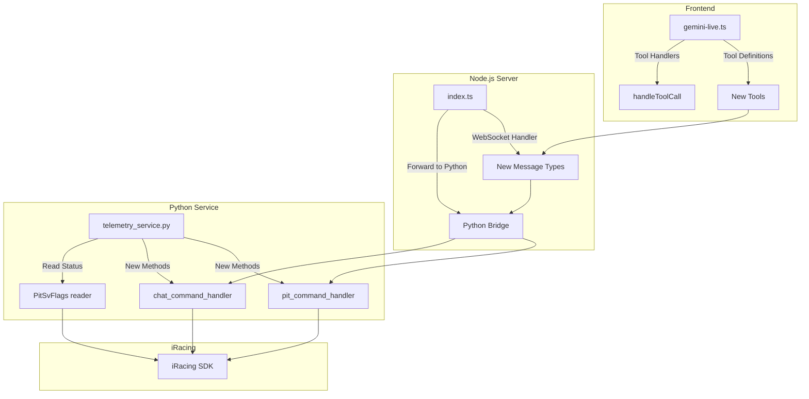

# Plan de Implementación: Nuevas Funcionalidades iRacing

**Fecha:** 2026-01-27  
**Autor:** Architect Mode  
**Estado:** Pendiente de Aprobación

---

## Resumen Ejecutivo

Este documento detalla el plan de implementación para 3 nuevas funcionalidades solicitadas para la integración con iRacing:

1. **TrackWetness** - Estado de humedad de la pista (YA IMPLEMENTADO ✅)
2. **ChatCommandMode** - Control de chat desde Gemini (NUEVA TOOL)
3. **PitCommandMode** - Control de pitstop desde Gemini (NUEVA TOOL - FEATURE PRINCIPAL)

---

## 1. TrackWetness - Estado de Humedad de Pista

### Estado: ✅ YA IMPLEMENTADO

La clase `TrackWetness` de pyirsdk **ya está siendo utilizada** en el sistema actual.

### Ubicación en el código:

**[`server/telemetry_service.py`](../server/telemetry_service.py:932)**
```python
track_wetness = self._safe_get('TrackWetness', 0)
```

**[`server/telemetry_service.py`](../server/telemetry_service.py:1038)**
```python
'track': {
    'tempCelsius': round(track_temp, 1),
    'airTempCelsius': round(air_temp, 1),
    'wetness': track_wetness,  # <-- AQUÍ
    'skies': skies,
    'weatherDeclaredWet': weather_wet,
}
```

### Valores de TrackWetness:
| Valor | Significado |
|-------|-------------|
| 0 | unknown |
| 1 | dry |
| 2 | mostly_dry |
| 3 | very_lightly_wet |
| 4 | lightly_wet |
| 5 | moderately_wet |
| 6 | very_wet |
| 7 | extremely_wet |

### Mejora Propuesta:
Actualmente se envía el valor numérico. Podríamos añadir una traducción a texto legible:

```python
TRACK_WETNESS_NAMES = {
    0: 'unknown',
    1: 'dry',
    2: 'mostly_dry',
    3: 'very_lightly_wet',
    4: 'lightly_wet',
    5: 'moderately_wet',
    6: 'very_wet',
    7: 'extremely_wet',
}

# En el telemetry object:
'track': {
    'wetness': track_wetness,
    'wetnessName': TRACK_WETNESS_NAMES.get(track_wetness, 'unknown'),
}
```

---

## 2. ChatCommandMode - Control de Chat desde Gemini

### Estado: 🆕 NUEVA FUNCIONALIDAD

### Análisis de Viabilidad

**¿Es posible?** ✅ SÍ

pyirsdk proporciona el método [`ir.chat_command()`](../pyirsdk_Reference/irsdk.py:496-501):

```python
def chat_command(self, chat_command_mode=ChatCommandMode.begin_chat):
    return self._broadcast_msg(BroadcastMsg.chat_command, chat_command_mode)

def chat_command_macro(self, macro_num=0):
    return self._broadcast_msg(BroadcastMsg.chat_command, ChatCommandMode.macro, macro_num)
```

### Opciones Disponibles:
| Modo | Valor | Descripción |
|------|-------|-------------|
| macro | 0 | Ejecuta macro de chat 1-15 |
| begin_chat | 1 | Abre ventana de chat |
| reply | 2 | Responder al último chat privado |
| cancel | 3 | Cerrar ventana de chat |

### Implementación como Gemini Tool

**Dificultad:** 🟡 MEDIA

**Razón:** Los macros de chat son configurables por el usuario en iRacing. Gemini no puede saber qué hace cada macro sin que el usuario lo configure.

### Casos de Uso Prácticos:

1. **Macro de agradecimiento** - "Gracias por el espacio" después de un adelantamiento limpio
2. **Macro de disculpa** - "Sorry" después de un toque
3. **Macro de saludo** - "Good luck all" al inicio de carrera

### Propuesta de Tool:

```typescript
const chatCommandTool: FunctionDeclaration = {
  name: "send_chat_macro",
  description: "Sends a predefined chat macro in iRacing. Macros 1-15 are user-configured. Common uses: 1=Thanks, 2=Sorry, 3=Good luck. Use when driver asks to send a quick message or after incidents.",
  parameters: {
    type: Type.OBJECT,
    properties: {
      macroNumber: {
        type: Type.NUMBER,
        description: "Macro number 1-15. Common: 1=Thanks, 2=Sorry, 3=Good luck (user-configurable)",
      },
    },
    required: ["macroNumber"],
  },
};
```

### Flujo de Implementación:



---

## 3. PitCommandMode - Control de Pitstop desde Gemini

### Estado: 🆕 FEATURE PRINCIPAL - ALTA PRIORIDAD

### Análisis de Viabilidad

**¿Es posible?** ✅ SÍ, COMPLETAMENTE

pyirsdk proporciona el método [`ir.pit_command()`](../pyirsdk_Reference/irsdk.py:503-504):

```python
def pit_command(self, pit_command_mode=PitCommandMode.clear, var=0):
    return self._broadcast_msg(BroadcastMsg.pit_command, pit_command_mode, var)
```

### Comandos Disponibles:

| Comando | Valor | Descripción | Parámetro |
|---------|-------|-------------|-----------|
| clear | 0 | Limpiar todos los checkboxes | - |
| ws | 1 | Limpiar parabrisas (tear off) | - |
| fuel | 2 | Añadir combustible | Litros (0 = usar cantidad existente) |
| lf | 3 | Cambiar neumático delantero izquierdo | Presión en KPa (0 = usar existente) |
| rf | 4 | Cambiar neumático delantero derecho | Presión en KPa (0 = usar existente) |
| lr | 5 | Cambiar neumático trasero izquierdo | Presión en KPa (0 = usar existente) |
| rr | 6 | Cambiar neumático trasero derecho | Presión en KPa (0 = usar existente) |
| clear_tires | 7 | Desmarcar cambio de neumáticos | - |
| fr | 8 | Solicitar reparación rápida | - |
| clear_ws | 9 | Desmarcar limpieza parabrisas | - |
| clear_fr | 10 | Desmarcar reparación rápida | - |
| clear_fuel | 11 | Desmarcar añadir combustible | - |

### PitSvFlags - Estado Actual del Pitstop

**Confirmación:** ✅ Correcto, `PitSvFlags` reporta el estado actual de los checkboxes:

```python
class PitSvFlags:
    lf_tire_change     = 0x01  # Bit 1
    rf_tire_change     = 0x02  # Bit 2
    lr_tire_change     = 0x04  # Bit 3
    rr_tire_change     = 0x08  # Bit 4
    fuel_fill          = 0x10  # Bit 5
    windshield_tearoff = 0x20  # Bit 6
    fast_repair        = 0x40  # Bit 7
```

Se lee con: `ir['PitSvFlags']`

### Propuesta de Tool Principal:

```typescript
const pitStopCommandTool: FunctionDeclaration = {
  name: "configure_pit_stop",
  description: `Configures the next pit stop in iRacing. ONLY works when driver is in the car. 
  Use when driver asks to set up pit strategy, add fuel, change tires, or request repairs.
  Examples: "Pon 40 litros para la próxima parada", "Cambia solo las traseras", "Quiero reparación rápida"`,
  parameters: {
    type: Type.OBJECT,
    properties: {
      action: {
        type: Type.STRING,
        enum: ["clear_all", "add_fuel", "change_tires", "fast_repair", "windshield", "clear_tires", "clear_fuel"],
        description: "Action to perform on pit stop configuration",
      },
      fuelAmount: {
        type: Type.NUMBER,
        description: "Fuel to add in LITERS. Only used with add_fuel action. 0 = use existing amount.",
      },
      tires: {
        type: Type.OBJECT,
        description: "Which tires to change. Only used with change_tires action.",
        properties: {
          lf: { type: Type.BOOLEAN, description: "Change left front tire" },
          rf: { type: Type.BOOLEAN, description: "Change right front tire" },
          lr: { type: Type.BOOLEAN, description: "Change left rear tire" },
          rr: { type: Type.BOOLEAN, description: "Change right rear tire" },
        },
      },
    },
    required: ["action"],
  },
};
```

### Tool Secundaria - Consultar Estado:

```typescript
const getPitStopStatusTool: FunctionDeclaration = {
  name: "get_pit_stop_status",
  description: "Returns the current pit stop configuration (what's checked for the next stop). Use to confirm settings or when driver asks what's configured.",
  parameters: {
    type: Type.OBJECT,
    properties: {},
  },
};
```

### Flujo de Implementación:



---

## Arquitectura de Implementación

### Componentes a Modificar:



### Archivos a Modificar:

| Archivo | Cambios |
|---------|---------|
| [`client/src/services/gemini-live.ts`](../client/src/services/gemini-live.ts) | Añadir tool definitions y handlers |
| [`server/src/index.ts`](../server/src/index.ts) | Añadir WebSocket message handlers |
| [`server/telemetry_service.py`](../server/telemetry_service.py) | Añadir pit_command y chat_command handlers |
| [`client/src/types/telemetry.types.ts`](../client/src/types/telemetry.types.ts) | Añadir tipos para pit status |

---

## Plan de Implementación Detallado

### Fase 1: Infraestructura de Comandos (Backend)

#### 1.1 Python - Añadir handlers de comandos

```python
# En telemetry_service.py

# Importar clases necesarias
from irsdk import PitCommandMode, ChatCommandMode, PitSvFlags

# Nuevo método para ejecutar pit commands
async def handle_pit_command(self, command: str, value: int = 0) -> dict:
    """Execute a pit command in iRacing."""
    if not self.connected:
        return {'success': False, 'error': 'Not connected to iRacing'}
    
    command_map = {
        'clear': PitCommandMode.clear,
        'ws': PitCommandMode.ws,
        'fuel': PitCommandMode.fuel,
        'lf': PitCommandMode.lf,
        'rf': PitCommandMode.rf,
        'lr': PitCommandMode.lr,
        'rr': PitCommandMode.rr,
        'clear_tires': PitCommandMode.clear_tires,
        'fr': PitCommandMode.fr,
        'clear_ws': PitCommandMode.clear_ws,
        'clear_fr': PitCommandMode.clear_fr,
        'clear_fuel': PitCommandMode.clear_fuel,
    }
    
    if command not in command_map:
        return {'success': False, 'error': f'Unknown command: {command}'}
    
    try:
        self.ir.pit_command(command_map[command], value)
        return {'success': True, 'command': command, 'value': value}
    except Exception as e:
        return {'success': False, 'error': str(e)}

# Nuevo método para leer estado del pit
def get_pit_status(self) -> dict:
    """Get current pit stop configuration."""
    flags = self._safe_get('PitSvFlags', 0)
    fuel_to_add = self._safe_get('PitSvFuel', 0)
    
    return {
        'lfTireChange': bool(flags & PitSvFlags.lf_tire_change),
        'rfTireChange': bool(flags & PitSvFlags.rf_tire_change),
        'lrTireChange': bool(flags & PitSvFlags.lr_tire_change),
        'rrTireChange': bool(flags & PitSvFlags.rr_tire_change),
        'fuelFill': bool(flags & PitSvFlags.fuel_fill),
        'fuelToAdd': fuel_to_add,
        'windshieldTearoff': bool(flags & PitSvFlags.windshield_tearoff),
        'fastRepair': bool(flags & PitSvFlags.fast_repair),
        'rawFlags': flags,
    }
```

#### 1.2 Node.js - Añadir bridge de comandos

```typescript
// En index.ts - Nuevo handler para comandos

// Mensaje desde frontend para ejecutar pit command
ws.on('message', (data) => {
  const msg = JSON.parse(data.toString());
  
  if (msg.type === 'PIT_COMMAND') {
    // Forward to Python service
    pythonWs.send(JSON.stringify({
      type: 'pit_command',
      command: msg.command,
      value: msg.value || 0,
    }));
  }
  
  if (msg.type === 'CHAT_COMMAND') {
    pythonWs.send(JSON.stringify({
      type: 'chat_command',
      macroNumber: msg.macroNumber,
    }));
  }
});
```

### Fase 2: Tools de Gemini (Frontend)

#### 2.1 Definir nuevas tools

```typescript
// En gemini-live.ts

const configurePitStopTool: FunctionDeclaration = {
  name: "configure_pit_stop",
  description: `Configures the next pit stop in iRacing. Use when driver asks about pit strategy.
  Actions: clear_all, add_fuel, change_tires, fast_repair, windshield
  Examples: "Pon 40 litros", "Cambia solo traseras", "Quiero fast repair"`,
  parameters: {
    type: Type.OBJECT,
    properties: {
      action: {
        type: Type.STRING,
        enum: ["clear_all", "add_fuel", "change_tires", "fast_repair", "windshield", "clear_tires", "clear_fuel"],
      },
      fuelAmount: {
        type: Type.NUMBER,
        description: "Liters to add (only for add_fuel)",
      },
      tires: {
        type: Type.STRING,
        enum: ["all", "fronts", "rears", "left", "right", "lf", "rf", "lr", "rr"],
        description: "Which tires to change",
      },
    },
    required: ["action"],
  },
};

const getPitStatusTool: FunctionDeclaration = {
  name: "get_pit_status",
  description: "Returns current pit stop configuration. Use to confirm what's set up.",
  parameters: { type: Type.OBJECT, properties: {} },
};

const sendChatMacroTool: FunctionDeclaration = {
  name: "send_chat_macro",
  description: "Sends a chat macro (1-15). Common: 1=Thanks, 2=Sorry. Use after incidents or clean passes.",
  parameters: {
    type: Type.OBJECT,
    properties: {
      macroNumber: {
        type: Type.NUMBER,
        description: "Macro 1-15",
      },
    },
    required: ["macroNumber"],
  },
};
```

#### 2.2 Implementar handlers

```typescript
// En handleToolCall()

} else if (fc.name === "configure_pit_stop") {
  const { action, fuelAmount, tires } = fc.args || {};
  
  // Send command to backend
  const result = await this.sendPitCommand(action, fuelAmount, tires);
  
  this.session.sendToolResponse({
    functionResponses: [{
      id: fc.id,
      name: fc.name,
      response: { result },
    }],
  });

} else if (fc.name === "get_pit_status") {
  const status = await this.getPitStatus();
  
  this.session.sendToolResponse({
    functionResponses: [{
      id: fc.id,
      name: fc.name,
      response: { result: status },
    }],
  });

} else if (fc.name === "send_chat_macro") {
  const { macroNumber } = fc.args || {};
  
  const result = await this.sendChatMacro(macroNumber);
  
  this.session.sendToolResponse({
    functionResponses: [{
      id: fc.id,
      name: fc.name,
      response: { result },
    }],
  });
}
```

### Fase 3: Integración y Testing

#### 3.1 Actualizar System Prompt

Añadir al system prompt de Gemini:

```
## NUEVAS HERRAMIENTAS DE CONTROL

### configure_pit_stop
Configura la próxima parada en boxes. SOLO funciona cuando el piloto está en el coche.
- "Pon X litros" → action: add_fuel, fuelAmount: X
- "Cambia las 4 ruedas" → action: change_tires, tires: all
- "Solo traseras" → action: change_tires, tires: rears
- "Fast repair" → action: fast_repair
- "Limpia el parabrisas" → action: windshield
- "Quita el combustible" → action: clear_fuel

### get_pit_status
Consulta qué está configurado para la próxima parada.
Úsala para confirmar antes de responder sobre estrategia de pit.

### send_chat_macro
Envía un mensaje predefinido en el chat de iRacing.
- Macro 1: Normalmente "Thanks" / "Gracias"
- Macro 2: Normalmente "Sorry" / "Perdón"
Úsala cuando el piloto pida agradecer o disculparse.
```

---

## Consideraciones de Seguridad

### Validaciones Necesarias:

1. **Verificar conexión a iRacing** antes de ejecutar comandos
2. **Verificar que el piloto está en el coche** (no en menús/replay)
3. **Validar rangos de combustible** (0-999 litros)
4. **Rate limiting** para evitar spam de comandos
5. **Confirmación verbal** para acciones críticas (clear_all)

### Ejemplo de Validación:

```python
def handle_pit_command(self, command: str, value: int = 0) -> dict:
    # Validar conexión
    if not self.connected or not self.ir.is_connected:
        return {'success': False, 'error': 'Not connected to iRacing'}
    
    # Validar que estamos en sesión activa
    if not self.is_session_active():
        return {'success': False, 'error': 'Not in active session'}
    
    # Validar rango de combustible
    if command == 'fuel' and (value < 0 or value > 999):
        return {'success': False, 'error': 'Fuel must be 0-999 liters'}
    
    # Ejecutar comando...
```

---

## Ejemplos de Uso por Voz

### Escenario 1: Configurar parada completa
**Piloto:** "Para la próxima parada quiero 45 litros y cambio de las 4 ruedas"

**Gemini ejecuta:**
1. `configure_pit_stop(action: "add_fuel", fuelAmount: 45)`
2. `configure_pit_stop(action: "change_tires", tires: "all")`

**Gemini responde:** "Listo, 45 litros y 4 ruedas para la próxima parada."

### Escenario 2: Consultar y modificar
**Piloto:** "¿Qué tengo puesto para boxes?"

**Gemini ejecuta:** `get_pit_status()`

**Gemini responde:** "Tienes 30 litros y cambio de traseras. ¿Quieres modificar algo?"

**Piloto:** "Añade también las delanteras"

**Gemini ejecuta:** `configure_pit_stop(action: "change_tires", tires: "fronts")`

### Escenario 3: Chat rápido
**Piloto:** "Dale las gracias al de delante, me dejó pasar limpio"

**Gemini ejecuta:** `send_chat_macro(macroNumber: 1)`

**Gemini responde:** "Mensaje enviado."

---

## Resumen de Tareas

| # | Tarea | Archivo | Prioridad |
|---|-------|---------|-----------|
| 1 | Añadir TrackWetness name mapping | telemetry_service.py | Baja |
| 2 | Implementar pit_command handler | telemetry_service.py | Alta |
| 3 | Implementar chat_command handler | telemetry_service.py | Media |
| 4 | Implementar get_pit_status | telemetry_service.py | Alta |
| 5 | Añadir WebSocket bridge en Node.js | index.ts | Alta |
| 6 | Definir nuevas Gemini tools | gemini-live.ts | Alta |
| 7 | Implementar tool handlers | gemini-live.ts | Alta |
| 8 | Actualizar system prompt | gemini-live.ts | Alta |
| 9 | Añadir tipos TypeScript | telemetry.types.ts | Media |
| 10 | Testing end-to-end | - | Alta |

---

## Próximos Pasos

1. **Aprobar este plan** - Revisar y confirmar el enfoque
2. **Implementar Fase 1** - Backend (Python + Node.js)
3. **Implementar Fase 2** - Frontend (Gemini tools)
4. **Testing** - Probar en sesión real de iRacing
5. **Refinamiento** - Ajustar prompts y validaciones según feedback

---

**¿Deseas proceder con la implementación?**
