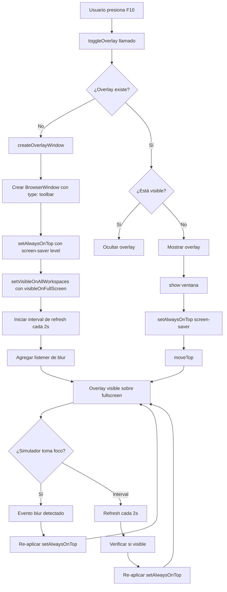

# Plan: Solución para Overlay Always-On-Top sobre Simulador Fullscreen

## Problema Identificado

El overlay de Electron se crea correctamente y muestra el mensaje "VISIBLE" en el terminal, pero **no se mantiene visible sobre el simulador en modo fullscreen exclusivo** (iRacing). La ventana se "hunde" detrás del simulador.

## Causa Raíz

Las aplicaciones fullscreen exclusivas en Windows (como iRacing) tienen prioridad sobre ventanas normales con `alwaysOnTop: true`. Electron necesita configuración adicional para mantener ventanas sobre aplicaciones fullscreen.

## Análisis del Código Actual

En [`electron-main.cjs`](../electron-main.cjs:174-207), la función `createOverlayWindow()` tiene:

```javascript
overlayWindow = new BrowserWindow({
    width: 140,
    height: 160,
    frame: false,
    transparent: true,
    alwaysOnTop: true,      // ⚠️ NO es suficiente para fullscreen exclusivo
    skipTaskbar: true,
    resizable: false,
    hasShadow: false,
    focusable: false,
    // ...
});
```

## Soluciones Propuestas

### Solución 1: Usar `setAlwaysOnTop()` con nivel elevado (RECOMENDADA)

Electron permite especificar diferentes niveles de "always on top":

```javascript
// Después de crear la ventana
overlayWindow.setAlwaysOnTop(true, 'screen-saver');
```

**Niveles disponibles en Windows:**
- `'normal'` - Por defecto, no funciona con fullscreen
- `'floating'` - Sobre ventanas normales
- `'torn-off-menu'` - Sobre menús desplegables  
- `'modal-panel'` - Sobre paneles modales
- `'main-menu'` - Sobre menús principales
- `'status'` - Sobre barras de estado
- `'pop-up-menu'` - Sobre menús popup
- `'screen-saver'` - **Máxima prioridad, sobre fullscreen** ⭐

### Solución 2: Refresh periódico de `alwaysOnTop`

Algunas aplicaciones fullscreen "roban" el z-order. Reforzar periódicamente:

```javascript
// Mantener overlay siempre visible
setInterval(() => {
    if (overlayWindow && !overlayWindow.isDestroyed()) {
        overlayWindow.setAlwaysOnTop(true, 'screen-saver');
        overlayWindow.moveTop(); // Forzar al frente
    }
}, 1000); // Cada segundo
```

### Solución 3: Configuración adicional de ventana

Agregar flags específicos para Windows:

```javascript
overlayWindow = new BrowserWindow({
    // ... configuración existente ...
    alwaysOnTop: true,
    skipTaskbar: true,
    focusable: false,
    
    // NUEVAS FLAGS
    type: 'toolbar',           // Tipo de ventana especial
    minimizable: false,
    maximizable: false,
    closable: true,
    
    webPreferences: {
        nodeIntegration: false,
        contextIsolation: true,
        backgroundThrottling: false,  // No throttle cuando está oculto
    }
});

// Después de crear
overlayWindow.setAlwaysOnTop(true, 'screen-saver');
overlayWindow.setVisibleOnAllWorkspaces(true, { visibleOnFullScreen: true });
```

### Solución 4: Listener de eventos de focus

Detectar cuando el simulador toma el foco y re-elevar el overlay:

```javascript
// En createOverlayWindow()
overlayWindow.on('blur', () => {
    // Cuando pierde el foco, volver a elevarlo
    if (overlayWindow && !overlayWindow.isDestroyed()) {
        overlayWindow.setAlwaysOnTop(true, 'screen-saver');
    }
});

// Listener global de cambio de ventana activa
app.on('browser-window-blur', () => {
    if (overlayWindow && overlayWindow.isVisible()) {
        overlayWindow.setAlwaysOnTop(true, 'screen-saver');
    }
});
```

## Implementación Recomendada (Combinación de Soluciones)

```javascript
function createOverlayWindow() {
  overlayWindow = new BrowserWindow({
    width: 140,
    height: 160,
    frame: false,
    transparent: true,
    alwaysOnTop: true,
    skipTaskbar: true,
    resizable: false,
    hasShadow: false,
    focusable: false,
    type: 'toolbar',              // ✅ NUEVO
    minimizable: false,           // ✅ NUEVO
    maximizable: false,           // ✅ NUEVO
    webPreferences: {
      nodeIntegration: false,
      contextIsolation: true,
      backgroundThrottling: false, // ✅ NUEVO
    }
  });
  
  // Posición inicial
  const { screen } = require('electron');
  const primaryDisplay = screen.getPrimaryDisplay();
  const { width } = primaryDisplay.workAreaSize;
  overlayWindow.setPosition(width - 160, 20);
  
  overlayWindow.loadURL(OVERLAY_URL);
  
  // ✅ NUEVO: Forzar nivel máximo de always-on-top
  overlayWindow.setAlwaysOnTop(true, 'screen-saver');
  
  // ✅ NUEVO: Visible en fullscreen
  overlayWindow.setVisibleOnAllWorkspaces(true, { 
    visibleOnFullScreen: true 
  });
  
  // ✅ NUEVO: Mantener siempre al frente
  const keepOnTopInterval = setInterval(() => {
    if (overlayWindow && !overlayWindow.isDestroyed() && overlayWindow.isVisible()) {
      overlayWindow.setAlwaysOnTop(true, 'screen-saver');
    }
  }, 2000); // Cada 2 segundos
  
  // ✅ NUEVO: Re-elevar cuando pierde foco
  overlayWindow.on('blur', () => {
    if (overlayWindow && !overlayWindow.isDestroyed()) {
      setTimeout(() => {
        overlayWindow.setAlwaysOnTop(true, 'screen-saver');
      }, 100);
    }
  });
  
  overlayWindow.on('closed', () => {
    clearInterval(keepOnTopInterval); // ✅ NUEVO: Limpiar interval
    overlayWindow = null;
  });
  
  console.log(`[Electron] Overlay window created with screen-saver level`);
}
```

## Consideraciones Adicionales

### 1. **Modo Borderless Windowed vs Fullscreen Exclusivo**

Si el usuario puede configurar iRacing en modo "Borderless Windowed" en lugar de "Fullscreen Exclusivo", el overlay funcionará mejor. Documentar esta opción como alternativa.

### 2. **Hotkey para re-elevar overlay**

Agregar un atajo adicional para forzar el overlay al frente:

```javascript
// En app.whenReady()
globalShortcut.register('F11', () => {
  if (overlayWindow && overlayWindow.isVisible()) {
    overlayWindow.setAlwaysOnTop(true, 'screen-saver');
    overlayWindow.moveTop();
    console.log('[Electron] Overlay forced to top');
  }
});
```

### 3. **Logging mejorado**

Agregar logs para diagnosticar el estado del overlay:

```javascript
function toggleOverlay() {
  if (!overlayWindow) {
    createOverlayWindow();
  } else if (overlayWindow.isVisible()) {
    overlayWindow.hide();
    console.log('[Electron] Overlay: HIDDEN');
  } else {
    overlayWindow.show();
    overlayWindow.setAlwaysOnTop(true, 'screen-saver');
    overlayWindow.moveTop();
    console.log('[Electron] Overlay: VISIBLE (screen-saver level)');
  }
}
```

## Diagrama de Flujo de la Solución



## Testing

### Casos de prueba:

1. ✅ **Overlay visible con escritorio normal**
   - Presionar F10, verificar que aparece

2. ✅ **Overlay sobre ventana normal de iRacing**
   - Abrir iRacing en modo ventana, verificar overlay visible

3. ✅ **Overlay sobre iRacing fullscreen borderless**
   - Configurar iRacing en borderless, verificar overlay visible

4. ⚠️ **Overlay sobre iRacing fullscreen exclusivo** (CRÍTICO)
   - Configurar iRacing en fullscreen exclusivo
   - Verificar que overlay permanece visible
   - Cambiar entre ventanas (Alt+Tab) y volver
   - Verificar que overlay se mantiene visible

5. ✅ **Overlay persiste después de Alt+Tab**
   - Con simulador corriendo, Alt+Tab a otra ventana
   - Volver al simulador
   - Verificar overlay sigue visible

6. ✅ **Hotkey F11 fuerza overlay al frente**
   - Si overlay se oculta, presionar F11
   - Verificar que vuelve al frente

## Archivos a Modificar

1. **[`electron-main.cjs`](../electron-main.cjs)** - Función `createOverlayWindow()` y `toggleOverlay()`
2. **[`plans/overlay-always-on-top-fix.md`](overlay-always-on-top-fix.md)** - Este documento (documentación)

## Referencias

- [Electron BrowserWindow.setAlwaysOnTop()](https://www.electronjs.org/docs/latest/api/browser-window#winsetalwaysontopflag-level-relativelevel)
- [Electron Window Levels](https://www.electronjs.org/docs/latest/api/browser-window#window-levels-macos)
- [Overlay sobre juegos fullscreen - Stack Overflow](https://stackoverflow.com/questions/tagged/electron+overlay)

## Próximos Pasos

1. Implementar cambios en `electron-main.cjs`
2. Probar con iRacing en diferentes modos de pantalla
3. Ajustar intervalo de refresh si es necesario (balance entre rendimiento y confiabilidad)
4. Documentar configuración recomendada de iRacing para usuarios
5. Considerar agregar opción en UI para cambiar nivel de overlay
